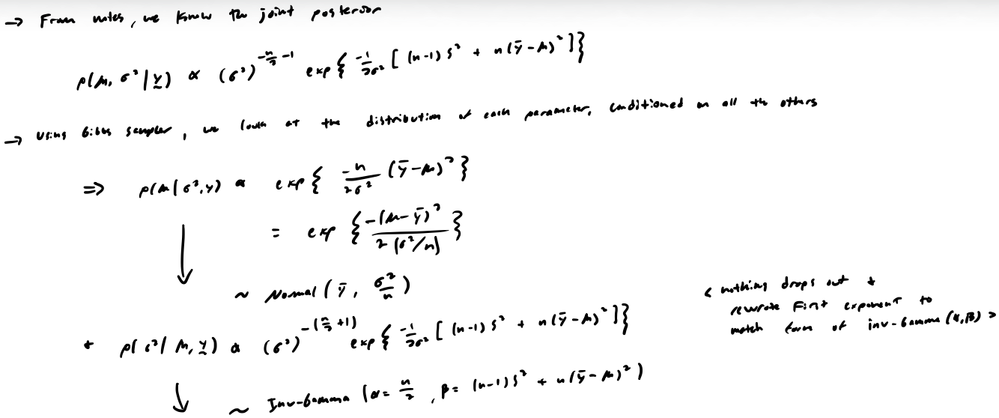

# Markov Chain Monte Carlo (MCMC)

## Notes

<embed src="lectures/notes-mcmc.pdf" type="application/pdf" width="100%" height="1000px"></embed>

## RStan

```{r}
#| label: load-prereqs
#| echo: false
#| message: false

# knitr options
source("_common.R")

```

### Intro

#### Installation

Install Rstan following the steps here: [https://github.com/stan-dev/rstan/wiki/RStan-Getting-Started](https://github.com/stan-dev/rstan/wiki/RStan-Getting-Started)

#### What is RStan

- A "black-box" MCMC sampler, i.e., a software package that produces posterior samples numerically when you specify the likelihood and prior distributions; (other options: BUGS, JAGS, etc.)
- Documentation: [https://mc-stan.org/](https://mc-stan.org/)

    - The [reference guide](https://mc-stan.org/docs/2_38/reference-manual/) has basics of the language, whereas the [user guide](https://mc-stan.org/docs/2_38/stan-users-guide/) is applications and model types.
    
- RStan converts the model description (`.stan`) file into C++ code and then compile it to obtain the posterior samples we want.
- Some easier examples can be found here: [https://github.com/stan-dev/rstan/wiki/RStan-Getting-Started#wiki-pages-box](https://github.com/stan-dev/rstan/wiki/RStan-Getting-Started#wiki-pages-box)

#### To use RStan

- You need to specify:
  - **Data, parameter, and model**

### Examples and explanations

#### Example 1: Binomial-Beta

Consider the following problem. There are 10 coins. For each coin, 100 tosses were done and the number of heads were recorded as follows.

- [20, 30, 35, 18, 22, 29, 37, 31, 36, 24]

Here is the Stan code. For quarto, best practice is to specify the Stan code in a string and then wrap it in `rstan::stan_model()`. Then run the model with `rstan::sampling()`. Can have a display chunk if want to have the syntax highlighting.

```stan
data {
  int<lower=0> m; // number of coins
  int<lower=0> n; // number of tosses
  int<lower=0> y[m]; // observations
}
parameters {
  real<lower=0, upper=1> p;
}
model {
  y ~ binomial(n, p); // data distribution
  p ~ beta(1, 1); // prior -> Beta (1,1) is equivalent to Uniform (0,1)
}
```

```{r}
#| cache: true

# specify stand code
stan_code1 <- "
data {
  int<lower=0> m;
  int<lower=0> n;
  int<lower=0> y[m];
}
parameters {
  real<lower=0, upper=1> p;
}
model {
  y ~ binomial(n, p);
  p ~ beta(1, 1);
}
"

# save as model
stan_mod1 <- rstan::stan_model(model_code = stan_code1)

```

Now we can provide data to the specified Stan model and run it. Note that you must pass a list object with all needed information to `rstan::sampling()` function. Arguments of `rstan::sampling()`:

- `chains` = the number of chains to make (each corresponding to a different initial value).
    - Usually two chains is not enough to estimate $\hat{R}$ well. Four or five chains is better.
- `warmup` = the number of burn-in iterations.
- `iter` = the number total number of iterations run (burn-in + keep ones).

```{r}
#| cache: true

# create data object to pass to Stan
# -> it needs it as a list
data_stan1 <- list(m = 10, n = 100,
                   y = c(20, 30, 35, 18, 22, 29, 37, 31, 36, 24))

# sampling from the posterior distributions
stan_fit1 <- rstan::sampling(object = stan_mod1, data = data_stan1,
                            seed = 1, chains = 2, warmup = 200, iter = 500)

# display the output
print(stan_fit1, digits = 2)

```

- An equivalent way run a Stan model is to define the model in the `.stan` file and do `mod_1 <- rstan::stan(file = <stan file>, data = <stan data>, <...>)`.

#### How stan actually works

Conceptual basics of Stan

1. We don't write the sampler

  - In Gibbs sampler, we manually specifying how each parameter updates. e.g. we are thinking: "First sample for $\sigma^2$ from its conditional. Then sample $\mu$ given $\sigma^2$."
  - In Stan, we only specify the model (i.e. priors + likelihood); we never write updates.
  
2. Think in terms of the joint posterior

- Stan targets $p(\theta \mid \mathbf{y}) \propto p(\mathbf{y} \mid \theta) \cdot p(\theta)$, which is what we write by hand.
- In Stan though, we only declare the pieces: data, parameters, priors and likelihood.
- Stan handles the inference.

3. Parameters are sampled as a vector

- Stan samples the full parameter vector jointly. Each iteration produces $\mathbf{\theta}^{(t)} = (\mathbf{\theta}_1^{(t)}, \ldots, \mathbf{\theta}_p^{(t)})$ as one object, even if they are declared separately.
- Because of this, dependencies between parameters are preserved automatically.
  
4. Stan works on the log posterior

- Stan uses the $\log$ to make calculations easier and it's needed for the algorithm it runs.
  - When we code below following this model: $Y \sim N(\mu, \sigma); \mu \sim N(0,10) \;\&\; \sigma \sim \text{cauchy}(0,5)$ (independent priors), Stan is actually accumulating $\log p(\mu, \sigma^2 \mid \mathbf{y}) = \log p(\mathbf{y} \mid \mu, \sigma^2) + \log p(\mu) + \log p(\sigma^2)$

```stan
model {
  mu ~ normal(0,10);
  sigma ~ cauchy(0,5);
  y ~ normal(mu, sigma);
}
```

- Note that "accumulating" is taken to mean:

```stan
target += log_density;
```

- i.e. Stan keeps a running total of the log probability by adding each log-density contribution to an internal variable called `target`, which represents $\log p(\theta \mid \mathbf{y})$. Stan builds this step by step.
- Conceptually, think this:
  - Start at $\text{target} = 0$
  - Then when we write `mu ~ normal(0, 10);` $\Rightarrow$ Stan translates it to `target += normal_lpdf(mu | 0, 10);` $\Rightarrow$ Which means $\text{target} \leftarrow \text{target} + \log p(\mu)$
  - Repeat for $\sigma$ and we have $\text{target} = \log p(\mu) + \log p(\sigma)$
  - Then if we write `y ~ normal(mu, sigma);` $\Rightarrow$ Stan adds `target += normal_lpdf(y | mu, sigma);` $\Rightarrow$ Now:
  
    $$\text{target} = \log p(\mu) + \log p(\sigma) + \sum_{i = 1}^n \log p(y_i \mid \mu, \sigma)$$
  
  - We are literally building the log joint posterior $\log p(\mathbf{\theta} \mid \mathbf{y})$ (each line increases the `target`).

5. Dependent priors example

- Continuing with the example from 4... If the prior for $\mu$ is now $\mu \sim N(0,\sigma)$, the only change in the model specification is in the prior line for $\mu$.

```stan
model {
  sigma ~ cauchy(0,5);
  mu ~ normal(0, sigma);
  y ~ normal(mu, sigma);
}
```

Easy as that; Stan automatically handles the dependency structure. Now it accumulates $\log p(\sigma) + \log p(\mu \mid \sigma) + \log p(y \mid \mu, \sigma)$. So the joint posterior becomes $p(\mu, \sigma \mid y) \propto p(y \mid \mu, \sigma) \, p(\mu \mid \sigma) \, p(\sigma)$. 

6. No need for conjugacy

- No full conditional derivations or Gibbs updates.
- Non-conjugate models work naturally.
- We just have to write the generative model.

Summary.

- Don't ask "How do I sample this parameter?"
- Rather ask "What is the probability model?"

#### Example 1 cont...

Now we can summarize the posterior samples.

```{r}

# obtain posterior samples
list_draws1 <- rstan::extract(stan_fit1)
hist(list_draws1$p)

# get overall summary statistics and for each chain
rstan::summary(stan_fit1)
# -> get other / specific quantities
rstan::summary(stan_fit1, pars = c("p"), probs = c(0.1, 0.9))$summary

# display default intial values used by rstan (because we didn't specify them)
# -> picks random values
rstan::get_inits(stan_fit1)

# display runtime (i.e. MCMC computation time (in seconds))
rstan::get_elapsed_time(stan_fit1) #-> results in 0s because super small simulation

```

We can also do prediction, just need to add a statement to the stan code:

```stan
// < previous statements >
generated quantities{
  real y_pred; // predicted future observation
  y_pred = binomial_rng(n, p);
}
```

```{r}
#| cache: true

# modify stan code to generate posterior predictions
# specify stand code
stan_code1 <- "
data {
  int<lower=0> m;
  int<lower=0> n;
  int<lower=0> y[m];
}
parameters {
  real<lower=0, upper=1> p;
}
model {
  y ~ binomial(n, p);
  p ~ beta(1, 1);
}
generated quantities{
  real y_pred;
  y_pred = binomial_rng(n, p);
}
"

# save, provide needed info, and run model
stan_mod1 <- rstan::stan_model(model_code = stan_code1)
data_stan1 <- list(m = 10, n = 100,
                   y = c(20, 30, 35, 18, 22, 29, 37, 31, 36, 24))
stan_fit1 <- rstan::sampling(object = stan_mod1, data = data_stan1,
                                 seed = 1, chains = 2, warmup = 200, iter = 500)

# view results
print(stan_fit1, digits = 2)
list_draws1 <- rstan::extract(stan_fit1)
hist(list_draws1$y_pred) # -> each y_pred represents the number of heads resulting from 100 flips of another coin

```

Summary: Things you need to make decisions about in a MCMC simulation

- How many MCMC chains (`chains`)
- How long each MCMC chain is (iterations = `iter`)
- Random seed for random number generation (`seed`)
- How many posterior samples will be discarded (burn-in = `warmup`)
- Thinning (`thin`)

#### Example 2: Normal models with power prior

This example is for normal models with unknown $\mu$ and $\sigma^2$ (nuisance parameter). We also have historical data that we want to take into account. Here is the stan code.

```stan
data {
  int<lower=0> m; // sample size of historical data
  int<lower=0> n; // sample size of current data
  real y0[m]; // historical data
  real y[n]; // current data
  real<lower=0, upper=1> a0; // power of the historical information
}
parameters {
  real mu;
  real<lower=0> sigma2;
}
// see note 1
model {
  y ~ normal(mu, sqrt(sigma2));
  target += a0 * normal_lpdf(y0 | mu, sqrt(sigma2)); // see note 2
  mu ~ normal(25, 4); // initial prior
  sigma2 ~ inv_gamma(2,1);
}
```

Notes:

1. We could also transform the parameters after declaring them as usual and then use the transformed version like usual.

```stan
transformed parameters {
  real<lower=0> sigma;
  sigma = sqrt(sigma2);
}
```

2. If we want to specify a user supplied density function in the model, or we want to compute the (log) marginal likelihood for a stan model, we need to directly use the (log) density functions instead of using `~` signs for specifying distributions.

Now run the model.

```{r}
#| cache: true

# specify stand code
stan_code2 <- "
data {
  int<lower=0> m;
  int<lower=0> n;
  real y0[m];
  real y[n];
  real<lower=0, upper=1> a0;
}
parameters {
  real mu;
  real<lower=0> sigma2;
}
model {
  y ~ normal(mu, sqrt(sigma2));
  target += a0 * normal_lpdf(y0 | mu, sqrt(sigma2));
  mu ~ normal(25, 4);
  sigma2 ~ inv_gamma(2,1);
}
"

# save model, provide data and run
stan_mod2 <- rstan::stan_model(model_code = stan_code2)
m <- 20
n <- 80
data_stan2 <- list(m, n, a0 = 0.5, # power of historical information
                   y0 = rnorm(n = m, mean = 20, sd = 1), y = rnorm(n = n, mean = 20, sd = 1))
stan_fit2 <- rstan::sampling(object = stan_mod2, data = data_stan2,
                            seed = 1, chains = 2, warmup = 200, iter = 500)

# view results
rstan::summary(stan_fit2)

```

Final notes:

- Recall, `target` is the log of the joint posterior density, which can be written as $p(\mathbf{\theta} \mid \mathbf{y}) \propto p(\mathbf{y} \mid \mathbf{\theta}) \cdot \pi(\mathbf{\theta})$.
    - $\Rightarrow \text{target} = \log{\text{< ... above... >}} = \log{p(\mathbf{y} \mid \mathbf{\theta})} + \log{\pi(\mathbf{\theta})}$
- If we were to do *normal models and non-informative prior* instead, $\mathbf{\theta} = (\mu, \sigma^2)$
    - Then the data distribution $\log{p(\mathbf{y} \mid \mu, \sigma^2)}$ is specified through `y ~ normal(mu, sqrt(sigma2))` (this version of the specification is used in the example above), which is equivalent to `target += normal_lpdf(y | mu, sqrt(sigma2))`.
    - But for the prior $\log{\pi(\mu, \theta)}$, since $\pi(\mu, \sigma^2) \propto (\sigma^2)^{-1}$, we cannot use distributions to specify this. However, we know that $\log{\pi(\mu, \sigma^2)} = -\log{\sigma^2}$.
    - Thus, the prior is specified by adding to `target`: `target += -log(sigma2)`.

## Homework

### Setup

*Water pollution has been an important environmental concern. A chemistry lab has been helping EPA with the water quality monitoring lab work in the past month. The concentration of a toxic chemical was measured for the water samples they received from EPA and the records are given below (unit: mg/L):*

```{r}

y <- c(580,674,572,540,616,298,960,570,640,588,556,588,582,844,574,420,696,620)

```

*The lab manager believes that these measures are from a normal population, but he is not sure about the mean or variance of such a population.*

### Part a

*Consider a Bayesian analysis of the data, if the noninformative prior, i.e. $p(\mu,\sigma^2) \propto \frac{1}{\sigma^2}$, is used, what is the joint posterior distribution of $\mu$ and $\sigma^2$? Please use simulation approach (MC) to obtain independent samples from the posterior distribution, and draw density curves or histogram that describes the marginal posterior density for each parameter. Describe the center, spread, skewness, outliers existing or not for the posterior distributions.*

As shown on page 2 of the notes above, we have the following posterior distributions for $\mu$ and $\sigma^2$, respectively:

$$
\begin{align*}
\mu &\sim \text{Normal}(\bar{y},\frac{\sigma^2}{n})\\
\sigma^2 &\sim \text{Inv-Gamma}(\frac{n-1}{2}, \frac{n-1}{2}\,S^2)
\end{align*}
$$

So, using MC simulation approach, we simply need to simulate a set of independent draws from the posterior distributions.

```{r}

# initialize needed values
m <- 10000
n <- length(y)

# sample from sigma^2 | y
post_sigma2 <- 1 / rgamma(n = m, shape = (n - 1) / 2, rate = (n - 1) / 2 * var(y))

# sample from mu | sigma^2, y
post_mu <- rnorm(n = m, mean = mean(y), sd = sqrt(post_sigma2 / n))

# visualize and summarize posterior samples
hist(post_mu, freq = FALSE)
summary(post_mu)
sd(post_mu)
hist(post_sigma2, freq = FALSE)
summary(post_sigma2 %>% sqrt)
sd(post_sigma2 %>% sqrt)

```

Description of posteriors:

- $\mu$: Unimodal and symmetric distribution (roughly normal) centered at $\bar{y} \approx 606$ with a st dev $\approx$ 35.
- $\sigma$: Right skewed distribution (mean $\approx$ 147.5, median $\approx$ 144.8) with a st dev $\approx$ 27.6. Contains high outliers.

### Part b

*Please find the 95% credible interval for $\mu$ and $\sigma^2$ respectively.*

From above, we know that the posterior distribution for $\mu$ is bell-shaped, so an equal-tails interval will be optimal. However for $\sigma^2$, a HPD interval will be better because of the skewness.

```{r}

# credible intervals of parameters
quantile(post_mu, probs = c(0.025, 0.975))
TeachingDemos::emp.hpd(post_sigma2, conf = 0.95) %>% sqrt

```

### Part c

*These water samples are from the Acton Reservoir in Ohio. EPA published a criteria that the average concentration of this chemical should be below 650 mg/L. What is the probability that the average concentration is below 650 based on the Bayesian analysis you carried out (Use the posterior samples in (a))?*

To find this probability, we can simply use our posterior sample for $\mu$.

```{r}

# calculate desired probability
mean(post_mu < 650)

```

### Part d

*If the lab receives a new water sample this month, what is the probability that the concentration measured for this new sample is below 650 based on the Bayesian analysis you carried out (Use MC approach, that is to use the samples in (a))?*

To find this probability, we must predict new observations using our posterior samples for $\mu$ and $\sigma^2$.

```{r}

# generate new observations using posterior samples
y_pred <- rnorm(n = m, mean = post_mu, sd = post_sigma2 %>% sqrt)

# calculate desired probability
mean(y_pred < 650)

```

### Part e

*Use Gibbs sampler (not Rstan) to draw samples from the posterior distribution. Draw the density curves or histograms for $\mu$ and $\sigma^2$. Based on the posterior samples, repeat (d).*



```{r}

# initialize results vectors with initial values already
post_mu_gibbs <- c(600)
post_sigma2_gibbs <- c(100)

# generate dependent draws from the conditional posterior distributions using gibbs sampler
# -> NOTE: make sure to ALWAYS be using the most updated information for each parameter (i.e. once mu[i+1] is generated, use it for sigma2[i+1])
# --> because of this dependency structure, the initial value of mu is never really used...
for (i in 1:(m - 1)) {
  
  post_mu_gibbs[i+1] <- rnorm(n = 1, mean = mean(y), sd = sqrt(post_sigma2_gibbs[i] / n))
  post_sigma2_gibbs[i+1] <- invgamma::rinvgamma(n = 1, shape = n / 2, rate = ((n - 1) * var(y) + n * (mean(y) - post_mu_gibbs[i+1])^2) / 2)
  
}

# generate new observations using posterior samples
y_pred_gibbs <- rnorm(n = m, mean = post_mu_gibbs, sd = post_sigma2_gibbs %>% sqrt)

# calculate desired probability
mean(y_pred_gibbs < 650)

```

Verify that using gibbs sampler resulted in a sample from the desired posterior distributions.

So, we know the theoretical results for this example. With Gibbs sampler, we sampled from the conditional posterior distributions in such a way that we were able to obtain samples from the marginal posteriors for both parameters. We already have the marginal posterior for $\sigma^2$, but for $\mu$, we need to integrate out $\sigma^2$. < skipping the steps >. The result of this is:

$\mu \mid \mathbf{y} \sim \text{t}_{n-t}(\bar{y}, \frac{\sigma^2}{n})$

Note that this is not the standard $t$-distribution. Here, it has a location and scale parameter. The location parameter shifts the entire distribution, and the scale parameter stretches / compresses the distribution (i.e. controlling how much it is spread around the center). These are completely different than the non-centrality parameter, which introduces asymmetry (in short).

```{r}

# BEST way to compare distributions is with a qqplot (just doing for mu...)
# -> first compare gibbs results to MC methods
qqplot(post_mu, post_mu_gibbs)
abline(0, 1, col = "red")

# -> now compare to marginal posterior (location-scale t-dist)
# -> ppoints(< vec >) just generates length(vec) probabilities between 0 and 1 (i.e. P(X < quantile) = ppoints[i])
qqplot(post_mu_gibbs, mean(y) + sqrt(var(y) / n) * qt(p = ppoints(post_mu_gibbs), df = n - 1))
abline(0, 1, col = "red")

# can also confirm by overlaying marginal posterior curve to gibbs sampler results
hist(post_mu_gibbs, freq = FALSE)
curve(dt((x - mean(y)) / sqrt(var(y) / n), df = n - 1) / sqrt(var(y) / n), col = "red", add = TRUE)

```

Note that extra steps in the `qt()` line are to take into account the location-scale aspect. `qt()` returns quantiles of the standard $t$-dist (i.e. y-values), so we just do this: $\mu = \bar{y} + \sqrt(\frac{\sigma^2}{n}) \, T$.

Same idea for using `dt()`, now we have to transform the density function. i.e. if $X \sim t_{n-1}(0,1)$ and $Y = \frac{X - a}{b}$ (where $a$ = location parameter, $b$ = scale parameter), then $f_Y(y) = \frac{1}{b}f_X(\frac{x - a}{b})$.

### Part f

*Use Rstan to build the model and repeat (d).*

Recall in the model statement here:

- We ONLY specify the **data distribution** and the **prior distribution(s)**, nothing else.
- We have a non-informative prior (i.e doesn't have a normal $\mu$ for a prior). So we have to add this manually to the target, which is already the log of the posterior.

```stan
data {
  int<lower=0> n;
  real y[n];
}
parameters {
  real mu;
  real<lower=0> sigma2;
}
model {
  y ~ normal(mu, sqrt(sigma2)); // data distribution
  target += -1 * log(sigma2); // add the information from our noninformative prior
}
generated quantities{
  real y_pred;
  y_pred = normal_rng(mu, sqrt(sigma2));
}
```

```{r}
#| cache: true

# specify stand code
stan_code <- "
data {
  int<lower=0> n;
  real y[n];
}
parameters {
  real mu;
  real<lower=0> sigma2;
}
model {
  y ~ normal(mu, sqrt(sigma2));
  target += -1 * log(sigma2);
}
generated quantities{
  real y_pred;
  y_pred = normal_rng(mu, sqrt(sigma2));
}
"

# save, provide needed info, and run model
stan_mod <- rstan::stan_model(model_code = stan_code)
data_stan <- list(n = length(y),
                  y = y)
stan_fit <- rstan::sampling(object = stan_mod, data = data_stan,
                             seed = 1, chains = 2, warmup = 200, iter = 10000)

# view results
print(stan_fit, digits = 2)
list_draws <- rstan::extract(stan_fit)

# calculate desired probability
mean(list_draws$y_pred < 650)

# confirm rstan results match MC results
qqplot(post_mu, list_draws$mu)
abline(0, 1, col = "red")

```